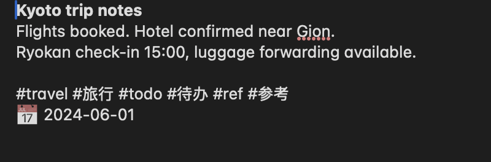
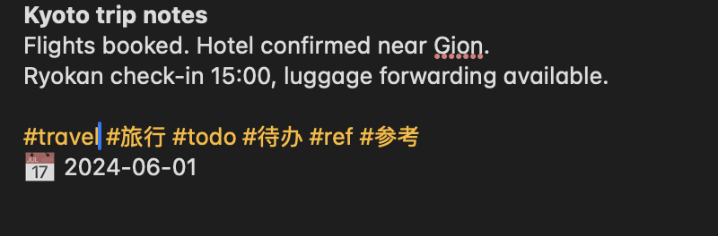
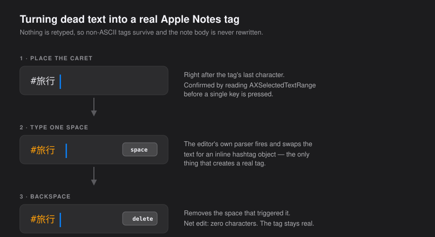
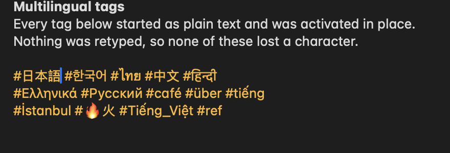

# apple-notes-tagger

**Create real Apple Notes tags from a script — including Chinese, Japanese and Korean ones.**

Apple Notes hashtags are not text. Each one is an inline object that only the
editor's own input parser creates. Write `#travel` into a note with AppleScript
and you get grey, inert text: it doesn't turn orange, it never shows up in the
Tags sidebar, and it can't drive a Smart Folder.

<table>
<tr><td align="center"><b>before — dead text</b></td><td align="center"><b>after — real tags</b></td></tr>
<tr><td></td>
    <td></td></tr>
</table>

This repo is a [Claude Code](https://claude.com/claude-code) skill plus two
standalone scripts that fix that, in place, without rewriting a single character
of your notes.

<sub>If you got here searching for <i>apple notes hashtag not working</i>,
<i>notes tag not turning orange</i>, <i>AppleScript can't create Notes tags</i>,
<i>set body hashtag plain text</i>, <i>Apple Notes tag Shortcuts automation</i>,
or <i>备忘录 标签 脚本 无效 / 不变色 / 中文标签</i> — yes, this is the fix.</sub>

---

## The trick

Every obvious route fails:

| Approach | Result |
|---|---|
| `set body of note to "…#travel…"` | Plain text — **and it destroys the note's attachments** |
| Paste a line containing `#travel ` | Plain text. Pasting doesn't trigger the parser |
| `keystroke "#travel "` | Real tag ✅ — but the input method eats non-ASCII: `#旅行` comes out `#aa` |

What works is not typing the tag at all:



Put the caret immediately after an existing `#tag`, **type one space** — the
parser fires and swaps the text for a real tag object — then **backspace** to
delete the space. Net edit: zero characters. Because nothing is retyped, the
input method is never involved, so `#旅行` and `#書摘` survive intact.

To *add* a brand-new tag, paste the text (the clipboard bypasses the input
method too) and then type the space.

## Verifying it worked, read-only

A real tag reads as **U+FFFC (``)** in `plaintext of note` and in the
accessibility `AXValue`; dead text still reads as `#travel`. Tag names come back
from AX as `AXDescription = "Tag travel"`. So you can audit an entire library
without touching it — and **without Full Disk Access**. This project never reads
or writes `NoteStore.sqlite`.

## Install

As a Claude Code plugin — two lines, nothing to copy by hand:

```
/plugin marketplace add kenshinice-ai/apple-notes-tagger
/plugin install apple-notes-tagger@apple-notes-tagger
```

Then just ask Claude things like *"my Notes hashtags are plain text, fix them"*,
*"tag my untagged Apple Notes"*, or *"add #travel to these notes"*.

Or drop the skill in by hand:

```bash
git clone https://github.com/kenshinice-ai/apple-notes-tagger.git
cp -r apple-notes-tagger/skills/apple-notes-tagger ~/.claude/skills/
```

Or ignore Claude entirely and run the scripts — they need only Python 3 and macOS.

## Usage

```bash
# read-only inventory: real-tag counts + notes whose tag line is still dead text
python3 skills/apple-notes-tagger/scripts/notes_tags.py scan --out backup.txt --dead-ids dead.ids

# repair them in place
caffeinate -dis python3 skills/apple-notes-tagger/scripts/notes_tags.py activate --ids dead.ids --vocab tags.txt

# add tags (Chinese included)
python3 skills/apple-notes-tagger/scripts/notes_tags.py add --ids some.ids --tags "#travel,#旅行"

# list / remove
python3 skills/apple-notes-tagger/scripts/notes_tags.py tags --id "x-coredata://…/ICNote/p123"
python3 skills/apple-notes-tagger/scripts/notes_tags.py remove --ids some.ids --tags "#draft"
```

### Auto-tagging

The scripts handle the mechanics; a model handles the judgment.

```bash
python3 skills/apple-notes-tagger/scripts/notes_tags.py export --out to-tag.jsonl   # untagged notes as JSONL
#   … read to-tag.jsonl, write "note-id<TAB>#tag1 #tag2" lines into tags.tsv …
python3 skills/apple-notes-tagger/scripts/notes_tags.py apply --map tags.tsv --dry-run
caffeinate -dis python3 skills/apple-notes-tagger/scripts/notes_tags.py apply --map tags.tsv
```

`export` skips notes that already have tags and notes that look like they hold
credentials (API keys, BSB/IBAN/SWIFT, card numbers, TFN, password/密码). It is a
heuristic, not a guarantee — read `to-tag.jsonl` before handing it to anything,
and use `--exclude-folder` for whatever should never leave the machine.

## Languages

Tag text goes in through the clipboard, never the keyboard, so the input method
never gets a chance to mangle it — and repairing an existing tag types nothing at
all. Every script below was created and read back on macOS 26:



| Script | `activate` (repair) | `add` / `remove` |
|---|---|---|
| Latin with diacritics — `#café` `#über` `#İstanbul` | ✅ | ✅ |
| CJK — `#中文` `#日本語` `#한국어` | ✅ | ✅ |
| Thai, Devanagari (combining marks) — `#ไทย` `#हिन्दी` | ✅ | ✅ |
| Greek, Cyrillic — `#Ελληνικά` `#Русский` | ✅ | ✅ |
| Vietnamese — `#tiếng` | ✅ | ✅ |
| Emoji / non-BMP — `#🔥火` | ✅ | ✅ |
| Right-to-left — `#عربي` `#עברית` | ⏭ skipped | ✅ |

**Right-to-left is the one real limitation.** Arrow keys move by *visual*
position in bidirectional text, not logical order, so the caret arithmetic that
`activate` depends on stops holding. A tag line containing RTL characters is
detected and skipped **before a single key is pressed**, and logged as `SKIP`
rather than counted as a failure. Adding and removing RTL tags works fine —
those paths never walk the caret through bidi text.

The tool also does not read the Notes UI in English: the app is located by bundle
identifier and tag names come back as raw accessibility descriptions, so a
non-English macOS works the same way.

## Requirements

- macOS, Notes app running
- **Automation → Notes** permission — check with
  `osascript -e 'tell application "Notes" to count notes'`
- **Accessibility** permission for whatever runs the scripts (Terminal, iTerm, …)
- Python 3
- **Not** Full Disk Access

While a batch runs, Notes must stay frontmost and the keyboard must be left
alone. Budget about **8 seconds per note**.

Tested in **Claude Code on macOS 26** against a 936-note library. It has not yet
been verified in Cowork — it should work anywhere the skill can run `osascript`
locally against a running Notes app, but that is untested. Reports from other
macOS versions are welcome.

## Safety

This drives a GUI, so it is built to fail closed:

- Every keystroke is preceded by a check that Notes is the frontmost process
- Every caret move is verified against `AXSelectedTextRange` before anything is
  typed — a mismatch aborts without pressing a key
- Every note is compared character-by-character against a precomputed expected
  body; on mismatch the script sends Cmd+Z, confirms full restoration, and skips
- Five consecutive failures stop the run
- `<log>.done` makes runs resumable — re-running skips finished notes
- `set body` is never used, so attachments are never touched

Field results: 933 notes, 4,124 tags, 0 failures, 0 attachments lost, 0 notes
altered outside their tag line.

Two things it will change that you should know about: **modification dates** are
bumped to today for every note touched (the property is read-only, so there is no
way around it), and a tag that was already converted cannot be told apart from an
attachment by position alone — `remove` refuses to act on a note where the counts
don't line up.

## 中文说明

Apple 备忘录的 `#标签` 不是文字，是内联对象，只有编辑器的输入解析会生成它。
用 AppleScript 写进去的 `#标签` 是死文本：不变色、不进 Tags 侧栏、不能驱动智能文件夹。

三条路都不通：`set body` 写出来是死文本**而且会摧毁附件**；粘贴整行不触发解析；
`keystroke` 重打能生成真标签，但中文会被输入法吃掉（`#旅行` 变成 `#aa`）。

**能用的办法是根本不重打**：把光标移到已有 `#标签` 的最后一个字后面，敲一个空格
（解析器当场把它换成真标签对象），再退格删掉这个空格。净编辑量为零，因为没有
重新打字，中文标签完整保留。新增标签则是粘贴标签文本再敲空格。

校验完全只读：真标签在 `plaintext of note` 和 AX 的 `AXValue` 里都显示为 ``，
死文本仍是 `#标签`；标签名可以从 `AXDescription = "Tag 旅行"` 读出。
**不需要「完全磁盘访问」**，本项目从不读写 `NoteStore.sqlite`。

实测：933 条笔记、4124 个标签、0 失败、0 附件丢失。

## Credits

Built by **Lee Liu** ([@kenshinice-ai](https://github.com/kenshinice-ai)) while
untangling a 936-note Apple Notes library, with [Claude Code](https://claude.com/claude-code).

The space-then-backspace trick, the `U+FFFC` verification path, and the
`AXDescription = "Tag <name>"` read were all found by experiment on macOS 26 —
if a future Notes release breaks any of them, please open an issue.

Issues and PRs welcome, especially reports from other macOS versions and from
non-Chinese non-ASCII tags (Japanese, Korean, Thai, Arabic).

## License

MIT © Lee Liu — see [LICENSE](LICENSE)
